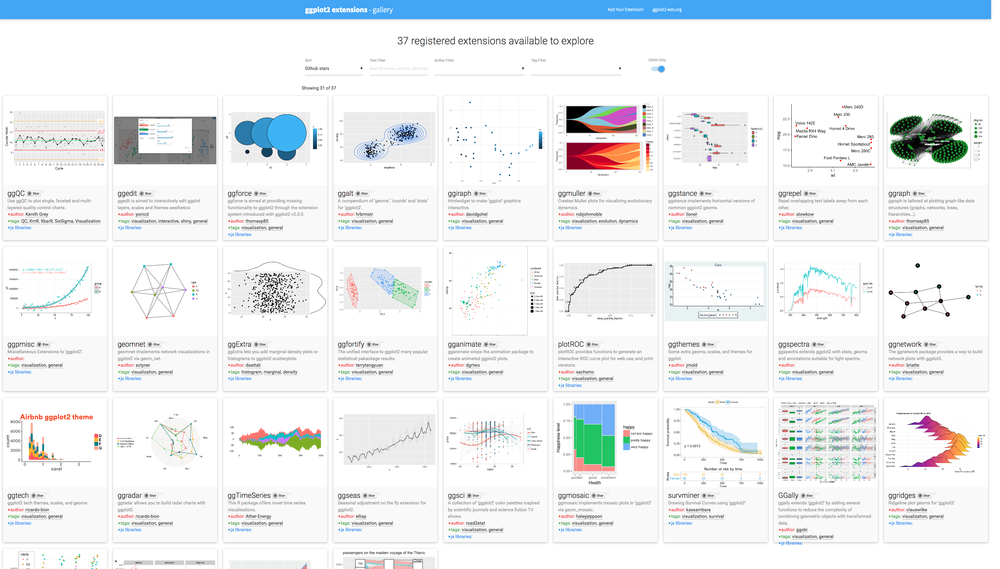

layout: false
class: inverse center middle text-white

.font200[Introduction to ggplot2]

```{r setup, include=FALSE}
knitr::opts_chunk$set(fig.width=4, fig.height=3.25, fig.retina=3,
                      out.width = "100%",
                      message=FALSE, warning=FALSE, cache = TRUE, 
                      autodep = TRUE, hiline=TRUE)

knitr::opts_hooks$set(fig.callout = function(options) {
  if (options$fig.callout) {
    options$echo <- FALSE
    options$out.height <- "99%"
    options$fig.width <- 16
    options$fig.height <- 8
  }
  options
})

options(
  htmltools.dir.version = FALSE, 
  width = 90,
  max.print = 9999,
  knitr.table.format = "html"
)

as_table <- function(...) knitr::kable(..., format='html', digits = 3)

library(countdown)

```

---
layout: true
# What we'll cover today.
---

- Brief intro to the theory behind `ggplot2` and the "grammar of graphics".

--

- The layers used to build a plot using `ggplot2`.

--

* What to consider as we make plots.

--

* How to use different geoms to create different types of plots (e.g. geom_line, geom_point).

--

* How to customise a plot using labs, theme, facet.


---
layout: true
# How would you draw a line graph by hand?
---

.left-column[
```{r example-table, echo = FALSE}
table_ex <- gapminder %>% 
  filter(
    country %in% c("Syria", "Rwanda", "Chile"), 
    year >= 1997
  ) %>% 
  select(country, year, pop) %>% 
  mutate(pop = signif(pop / 10^6, 3))

knitr::kable(table_ex, format = 'html')
```
]

--

.right-column[.font150[

1. Draw the axes, add tick marks.

2. Draw each line. Colour by country.

3. Add the axes labels.

4. Add a title.

5. Add a legend.

]]

---
layout: true
# How would you draw a bar graph by hand?
---

.left-column[
```{r example-table2, echo = FALSE}
table_ex <- gapminder %>% 
  filter(
    country %in% c("Syria", "Rwanda", "Chile"), 
    year >= 1997
  ) %>% 
  select(country, year, pop) %>% 
  mutate(pop = signif(pop / 10^6, 3))

knitr::kable(table_ex, format = 'html')
```
]

.right-column[.font150[

1. Draw the axes, add tick marks.

2. **Draw each bar.** Colour by country.

3. Add the axes labels.

4. Add a title.

5. Add a legend.

]]


---
layout: true
# How would you draw a graph?
---

.left-column[
```{r example-table3, echo = FALSE}
table_ex <- gapminder %>% 
  filter(
    country %in% c("Syria", "Rwanda", "Chile"), 
    year >= 1997
  ) %>% 
  select(country, year, pop) %>% 
  mutate(pop = signif(pop / 10^6, 3))

knitr::kable(table_ex, format = 'html')
```
]

.right-column[.font150[

1. What decisions did you make?

2. How did the data inform them?

3. Did you look at the values to decide the axes and tick marks?

4. How did you decide the labels?

]]


---

---
layout: true
# The grammar of graphics
---

.left-column[

__Grammar of Graphics__
]

.right-column[

* Computers also follow steps.

* The **grammar of graphics =** rules/steps for plotting.

* First published in 1999.

* Breaks down graphics into its constituent parts. 

*  Focus on the relationship between the **variables** and the *visual properties* of the graph (e.g. *colour* = **country**).

* Foundation for **ggplot2**, **tableau**, **vegalite** etc. 


]


---
layout: true
# What is *ggplot2*?
---

.left-column[

__Hadley Wickham__
]

.right-column[.font150[

* **gg**plot2 is the implementation of the **g**rammar of **g**raphics in R with some adaptations.

* ..."a powerful way of thinking about visualisation, as a way of **mapping between variables and the visual properties of geometric objects** that you can perceive."


]
.footnote[<http://disq.us/p/sv640d>]
]

---
layout: true
# Why use *ggplot2*?
---

- Package for .hl[functional] data visualization.

--
    1. Wrangle data
    
--

    2. Map data to visual elements
    
--

    3. Tweak scales, guides, axis, labels, theme
    
--

- Once you know the syntax it is easy to

--

  - .hl[Reason] about how data drives visualization

--

  - .hl[Iterate] to create multiple visualizations

--

  - Be .hl[consistent] in the visualizations you make.

---
layout: false

# Learning objectives

.left-column[

__ggplot2__
]

.right-column[.font150[
* `ggplot2` is a huge package with lots of options, but it's well documented and organized.


* We'll cover a lot, but won't have time to go into every specific. 


* The aim is to **equip** you with **where** and **what** to look for. 

]]


---
layout: true
# Getting started

---


**Option 1**: load the metapackage [tidyverse](http://tidyverse.org)

```r
library(tidyverse)
```

**Option 2**: load `ggplot2`

```r
library(ggplot2)
```

---
layout: false
class: inverse center middle text-white

.font200[gg is for<br>Grammar of Graphics]

```{r guess-data-from-plot-og, echo=FALSE}
df_mpg <- mpg %>% 
  filter(class %in% c("compact", "suv")) %>% 
  filter(manufacturer %in% c("toyota", "ford", "audi")) %>% 
  filter(year == 2008) %>% 
  group_by(manufacturer, model) %>% 
  sample_n(1)

g <- ggplot(df_mpg) +
  aes(x = cty, y = hwy, color = class, shape = manufacturer) +
  geom_point(size = 4) +
  labs(x = NULL, y = NULL, shape = NULL, color = NULL) +
  theme_bw() +
  theme(
    panel.grid = element_blank(),
    plot.background = element_rect(fill = rgb(250, 250, 250, max = 255),
                                   color = "#777777")
  )
```
---
layout: false
# How do we express visuals in words?

.font120[
- **Data** to be visualized
]

--
.font120[
- **.hlb[Aes]thetic mappings** from data to visual component
]

--
.font120[
- **.hlb[Geom]etric objects** that appear on the plot
]

--
.font120[
- **.hlb[Stat]istics** transform data on the way to visualization
]

--
.font120[
- **.hlb[Coord]inates** organize location of geometric objects
]

--
.font120[
- **.hlb[Scale]s** define the range of values for aesthetics
]

--
.font120[
- **.hlb[Facet]s** group into subplots
]

--

--
.font120[
- **.hlb[Theme]s** the visual elements of the plot not linked to the data
]


---
layout: true
# gg is for Grammar of Graphics

.left-column[
### Data

```r
ggplot(data)
```
]

---

.right-column[
#### Tidy Data

1. Each **variable** forms a .hl[column]

2. Each **observation** forms a .hl[row]

3. Each **value** is a .hl[cell]
]

--

.right-column[
#### Start by asking

1. What information do I want to use in my visualization?

2. Are my variables categorical? Are my variables numeric?

3. Do I want to look at the distribution of a single variable or the **relationship** between variables?

]

---

.right-column[
```{r tidy-messy1, results='asis', echo=FALSE}
pop_simple <- gapminder %>% 
  filter(
    country %in% c("Syria", "Rwanda", "Chile"), 
    year >= 1997
  ) %>% 
  select(country, year, pop) %>% 
  mutate(pop = pop / 10^6)

messy_pop <- pop_simple %>% pivot_wider(names_from = year, values_from = pop)

knitr::kable(pop_simple, format = 'html')
```
]

---
layout: true
# gg is for Grammar of Graphics

.left-column[
### Data
### Aesthetics

```r
+ aes()
```

]
---

.right-column[
Map data to visual elements or parameters

- year

- pop

- country

```{r tidy-tidy-show, result='asis', echo=F}
tidy_pop <- pivot_longer(data = messy_pop, cols = !country, names_to = "year", values_to = "pop")
tidy_pop %>%
  head(4) %>%
  as_table()
```
]

---

.right-column[
Map data to visual elements or parameters

- year → **x**

- pop → **y**

- country → *shape*, *color*, etc.


```{r tidy-tidy-show-2, result='asis', echo=F}
tidy_pop <- pivot_longer(data = messy_pop, cols = !country, names_to = "year", values_to = "pop")
tidy_pop %>%
  head(4) %>%
  as_table()
```

]

---

.right-column[
Map data to visual elements or parameters

```r
aes(
  x = year,
  y = pop,
  colour = country
)
```
]

---
layout: true
# gg is for Grammar of Graphics

.left-column[
### Data
### Aesthetics
### Geoms

```r
+ geom_*()
```
]

---

.right-column[
* What geoms have you seen so far?
]

---

.right-column[
Here are the [some of the most widely used geoms](https://eric.netlify.com/2017/08/10/most-popular-ggplot2-geoms/)

.font70.center[
| Type | Function |
|:----:|:--------:|
| Point | `geom_point()` |
| Line | `geom_line()` |
| Bar | `geom_bar()`, `geom_col()` |
| Histogram | `geom_histogram()` |
| Regression | `geom_smooth()` |
| Boxplot | `geom_boxplot()` |
| Text | `geom_text()` |
| Vert./Horiz. Line | `geom_{vh}line()` |
| Count | `geom_count()` |
| Density | `geom_density()` |

<https://eric.netlify.com/2017/08/10/most-popular-ggplot2-geoms/>
]
]


---

.right-column[

See <http://ggplot2.tidyverse.org/reference/> for many more options

.font70[
```{r ggplot2-geom-names, echo=FALSE}
# geom_
old_width = options(width = 80)
lsf.str("package:ggplot2") %>% grep("^geom_", ., value = TRUE)
options(width = old_width$width)
```
]
]

---

.right-column[

Or just start typing `geom_` in RStudio
]

---
layout: true
# Which geom to choose?
---

- Variable types

- Type of plot (Distribution, Relationship, Count, Part of Whole etc.)

- Use the [R Graphy Gallery](https://www.r-graph-gallery.com/index.html) for inspiration


---
layout: true
# Our first plot!
---

.left-code[
```{r first-plot1a, eval=FALSE}
ggplot(tidy_pop)
```
]

.right-plot[
```{r first-plot1a, ref.label='first-plot1a', echo=FALSE, out.width="100%"}
```
]

---

.left-code[
```{r first-plot1b, eval=FALSE}
ggplot(tidy_pop,
  aes(x = year, #<<
      y = pop) #<<
  )
```
]

.right-plot[
```{r first-plot1b, ref.label='first-plot1b', echo=FALSE, out.width="100%"}
```
]

---

.left-code[
```{r first-plot1c, eval=FALSE}
ggplot(tidy_pop,
  aes(x = year,
      y = pop)
  ) +
  geom_point() #<<
```
]

.right-plot[
```{r first-plot1c, ref.label='first-plot1c', echo=FALSE, out.width="100%"}
```
]

---

.left-code[
```{r first-plot1, eval=FALSE}
ggplot(tidy_pop,
  aes(x = year,
      y = pop,
      color = country) #<<
  ) + 
  geom_point()
```
]

.right-plot[
```{r first-plot1, ref.label='first-plot1', echo=FALSE, out.width="100%"}
```
]

---

.left-code[
```{r first-plot2-fake, eval=FALSE}
ggplot(tidy_pop,
  aes(x = year,
      y = pop,
      color = country) 
  ) +
  geom_point() +
  geom_line() #<<
```

.font80[
```r
geom_path: Each group consists
of only one observation. 
Do you need to adjust the 
group aesthetic?
```
]
]

.right-plot[
```{r first-plot2-fake, ref.label='first-plot2-fake', echo=FALSE, out.width="100%"}
```
]
---

.left-code[
```{r first-plot2, eval=FALSE}
ggplot(tidy_pop,
  aes(x = year,
      y = pop,
      color = country) 
  ) +
  geom_point() +
  geom_line(
    aes(group = country)) #<<
```
]

.right-plot[
```{r first-plot2, ref.label='first-plot2', echo=FALSE, out.width="100%"}
```
]

---


.left-code[
```{r first-plot3, eval=FALSE}
g <- ggplot(tidy_pop, #<<
  aes(x = year,
      y = pop,
      color = country) 
  ) +
  geom_point() +
  geom_line(
    aes(group = country))

g #<<
```
]

.right-plot[
```{r first-plot3, ref.label='first-plot2', echo=FALSE, out.width="100%"}
```
]

---
layout: true
# gg is for Grammar of Graphics

.left-column[
### Data
### Aesthetics
### Geoms

```r
+ geom_*()
```
]
---

.right-column[
```r
geom_*(mapping = aes(), data, stat, position)
```

- `data` Geoms can have their own data
    - Has to map onto global coordinates

- `aes` Geoms can have their own aesthetics
    - Inherits global aesthetics
    - Have geom-specific aesthetics
        - `geom_point` needs `x` and `y`, optional `shape`, `color`, `size`, etc.
        - `geom_ribbon` requires `x`, `ymin` and `ymax`, optional `fill`
    - Use `?` to find out the aesthetics required and the ones you can change:
    `?geom_ribbon`
]

---

.right-column[
```r
geom_*(mapping, data, stat, position)
```

- `stat` Some geoms apply further transformations to the data
    - All respect `stat = 'identity'`
    - Ex: `geom_histogram` uses `stat_bin()` to group observations
    
- `position` Some adjust location of objects
    - `'dodge'`, `'stack'`, `'jitter'`
]

---
layout: true
# Our first plot!
---

.left-code[
```{r first-plot-geom-1, eval=FALSE}
g <- ggplot() +
  geom_point(
    data = tidy_pop, #<<
    aes(x = year, #<<
      y = pop, #<<
      color = country) #<<
  ) +
  geom_line(
    data = tidy_pop, #<<
    aes(x = year, #<<
      y = pop, #<<
      color = country, #<<
      group = country) #<<
    )

g
```
]

.right-plot[
```{r first-plot-geom-1, ref.label='first-plot-geom-1', echo=FALSE, out.width="100%"}
```
]

---
layout: true
# gg is for Grammar of Graphics

.left-column[
### Data
### Aesthetics
### Geoms

```r
+ geom_*()
```
]
---

.right-column[
```r
geom_*(mapping = aes(), data, stat, position)
```

- `data` Geoms can have their own data
    - Has to map onto global coordinates

.font150[What would the advantage be for a geom to have their own data?]

]

---
layout: true
# gg is for Grammar of Graphics

.left-column[
### Data
### Aesthetics
### Geoms
### Facet

```r
+facet_wrap() 

+facet_grid()
```
]
---

```{r geom_facet_setup, include=FALSE, eval = TRUE}
tidy_pop2 <- left_join(tidy_pop, select(gapminder, country, continent))

g <- ggplot(tidy_pop2) +
  aes(x = year,
      y = pop,
      color = country) +
  geom_point() +
  geom_line(aes(group = country))
```

.right-plot[
```{r geom_facet, eval = TRUE, echo=TRUE, out.width="90%", fig.width=6}
g + facet_wrap(~ country)
```
]

---

.right-column[
```{r geom_grid, eval = TRUE, echo=TRUE, out.width="90%", fig.width=6}
g + facet_grid(continent ~ country)
```
]

---
layout: true
# gg is for Grammar of Graphics

.left-column[
### Data
### Aesthetics
### Geoms
### Facet
### Labels

```r
+ labs()
```
]
---

```{r geom_label_setup, include=FALSE, eval = TRUE}
tidy_pop2 <- left_join(tidy_pop, select(gapminder, country, continent))

g <- ggplot(tidy_pop2) +
  aes(x = year,
      y = pop,
      color = country) +
  geom_point() +
  geom_line(aes(group = country))
```


.right-column[
```{r labs-ex, eval = TRUE, echo=TRUE, out.width="90%", fig.width=6}
(g <- g + labs(x = "Year", y = "Population (millions)"))
```
]

---
layout: true
# gg is for Grammar of Graphics

.left-column[
### Data
### Aesthetics
### Geoms
### Facet
### Labels
### Coords

```r
+ coord_*()
```
]
---

```{r geom_coord_setup, include=FALSE, eval = TRUE}
tidy_pop2 <- left_join(tidy_pop, select(gapminder, country, continent))

g <- ggplot(tidy_pop2) +
  aes(x = year,
      y = pop,
      color = country) +
  geom_point() +
  geom_line(aes(group = country))

g <- g + labs(x = "Year", y = "Population (millions)")
```


.right-column[
```{r coord-ex, eval = TRUE, echo=TRUE, out.width="90%", fig.width=6}
g + coord_flip()
```
]

---
layout: true
# gg is for Grammar of Graphics

.left-column[
### Data
### Aesthetics
### Geoms
### Facet
### Labels
### Coords
### Scales

```r
+ scale_*_*()
```
]
---

.right-column[ 
`scale` + `_` + `<aes>` + `_` + `<type>` + `()`

`<aes>` = parameter to adjust; `<type>` = Parameter Type
]
--

.right-column[
- I want to use a different color palette<br>`scale_fill_discrete()`<br>`scale_color_continuous()` <br> - I want to use an accessible color palette <br> `scale_colour_viridis_d()`
]

--

.right-column[
- I want to rescale y-axis as log<br>`scale_y_log10()`
]

--

.right-column[
- I want to change my discrete x-axis<br>`scale_x_discrete()`
]


---

```{r geom_scale_setup, include=FALSE, eval = TRUE}
tidy_pop2 <- left_join(tidy_pop, select(gapminder, country, continent))

g <- ggplot(tidy_pop2) +
  aes(x = year,
      y = pop,
      color = country) +
  geom_point() +
  geom_line(aes(group = country))

g <- g + labs(x = "Year", y = "Population (millions)")
```

.right-column[
```{r scale_ex1, eval = TRUE, out.width="90%", fig.width=6}
g + scale_color_manual(values = c("peru", "pink", "plum"))
```
]

---

.right-column[
```{r scale_ex2, eval = TRUE, out.width="90%", fig.width=6}
g + scale_y_log10()
```
]

---

.right-column[
```{r scale_ex4, eval = TRUE, out.width="90%", fig.width=6}
g + scale_x_discrete(labels = c("MCMXCVII", "MMII", "MMVII"))
```
]

---
layout: true
# gg is for Grammar of Graphics

.left-column[
### Data
### Aesthetics
### Geoms
### Facet
### Labels
### Coords
### Scales
### Theme

```r
+ theme()
```
]

---

.right-column[
Change the appearance of plot decorations<br>
i.e. things that aren't mapped to data

A few "starter" themes ship with the package

- `g + theme_bw()`
- `g + theme_dark()`
- `g + theme_gray()`
- `g + theme_light()`
- `g + theme_minimal()`

]

---

.right-column[

```{r theme_ex1, eval = TRUE, out.width="90%", fig.width=6}
g + theme_bw()
```

]

---
.right-column[
Huge number of parameters, grouped by plot area:

- Global options: `line`, `rect`, `text`, `title`
- `axis`: x-, y- or other axis title, ticks, lines
- `legend`: Plot legends
- `panel`: Actual plot area
- `plot`: Whole image
- `strip`: Facet labels
]
---

.right-column[
Theme options are supported by helper functions:

- `element_blank()` removes the element
- `element_line()`
- `element_rect()`
- `element_text()`
]

---

.right-column[
.font80[
```{r, eval = TRUE, out.width="90%", fig.width=6}
g + theme_bw() + theme(text = element_text(colour = "hotpink", size = 20))
```
]
]

---

.right-column[
You can also set the theme globally with `theme_set()`

```{r theme_set}
my_theme <- theme_bw() +
  theme(
    text = element_text(family = "Palatino", size = 12),
    panel.border = element_rect(colour = 'grey80'), 
    panel.grid.minor = element_blank()
  )

theme_set(my_theme)
```

All plots will now use this theme!
]

---

.right-column[
```{r, eval = TRUE, out.width="90%", fig.width=6, dependson='theme_set', echo = -1}

g + theme(legend.position = 'bottom')
```
]

---
layout: false
# Save Your Work

To save your plot, use **ggsave**. 

```{r ggsave, eval=FALSE}
ggsave(
  filename = "my_plot.png",
  plot = my_plot,
  width = 10,
  height = 8,
  dpi = 100,
  device = "png"
)
```
---
layout: false
class: inverse, middle, center

# Recap and where to go next
---
layout: true
# Plots are built in layers
---

.font120[
- **Data** must be in a "tidy" format.
]

--
.font120[
- **.hlb[Aes]thetic mappings** link variables in the data to graphical properties in the **.hlb[geom]**etric objects.

]

--
.font120[
- **.hlb[Geom]etric objects** dictate how the **.hlb[aes]thetics** are interpreted as a graphical representation (points, lines, polygons, etc.)
]

--
.font120[
- **.hlb[Stat]istics** transform the input variables to displayed values. E.g. calculate the summary statistics for a boxplot (quantiles).
]

--
.font120[
- **.hlb[Coord]inates** organize location of geometric objects, i.e. define the physical mapping of the aesthetics.
]

---
layout: true
# Plots are built in layers
---

.font120[
- **.hlb[Scale]s** define the range of values for aesthetics (e.g. categories -> colours).
]

--
.font120[
- **.hlb[Facet]s** define the number of panels and how to split data among them (e.g. by country).
]

--
.font120[
- **.hlb[Theme]s** control every part of the graphic that is not linked to the data (i.e. font, visual appearance).
]

---
layout: true
# Stack Exchange is Great!
---


---


---
layout: false

# ggplot2 Extensions: ggplot2-exts.org



---
# ggplot2 and beyond

### Learn more

- **Draw anything with ggplot2**: <https://github.com/thomasp85/ggplot2_workshop>

- **Be the boss of your factors and other useful tips:** <https://stat545.com/index.html>

- **ggplot2 docs:** <http://ggplot2.tidyverse.org/>

- **R4DS - Data visualization:** <http://r4ds.had.co.nz/data-visualisation.html>

- **Hadley Wickham's ggplot2 book:** <https://www.amazon.com/dp/0387981403/>

---
# ggplot2 and beyond

### Noteworthy RStudio Add-Ins

- [esquisse](https://github.com/dreamRs/esquisse): Interactively build ggplot2 plots

- [ggplotThemeAssist](https://github.com/calligross/ggthemeassist): Customize your ggplot theme interactively

- [ggedit](https://github.com/metrumresearchgroup/ggedit): Layer, scale, and theme editing

---

# Practice and Review

### #TidyTuesday

- <https://github.com/rfordatascience/tidytuesday>

### Fun Datasets

- `fivethirtyeight`

- `nycflights`

- `ggplot2movies`


---
class: inverse, center, middle

# Thanks!

Slides created via the R package [xaringan](https://github.com/yihui/xaringan).

The chakra comes from [remark.js](https://remarkjs.com), [knitr](http://yihui.org/knitr), and [R Markdown](https://rmarkdown.rstudio.com).

.font150.text-white[
Slides and code adapted from Garrick Aden-Buie GitHub: <http://github.com/gadenbuie/gentle-ggplot2>
]

